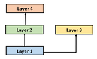
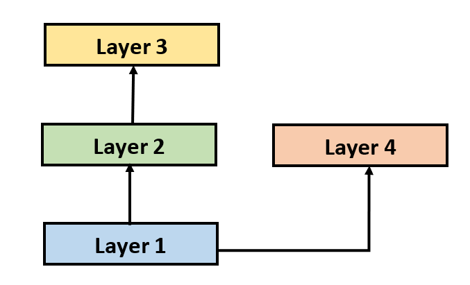
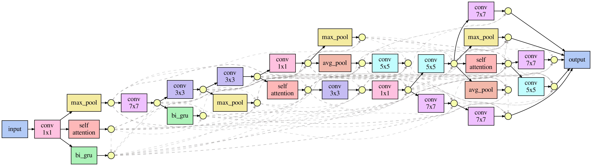
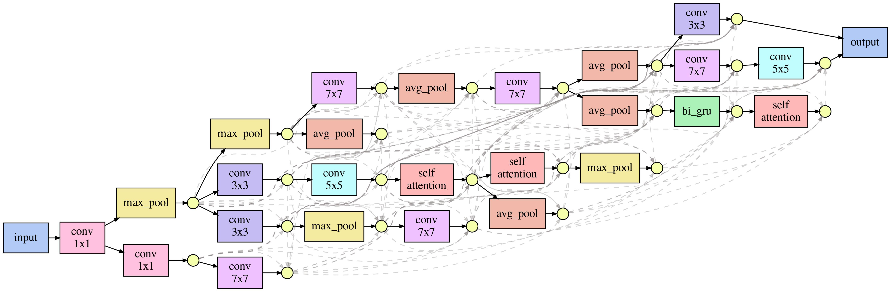
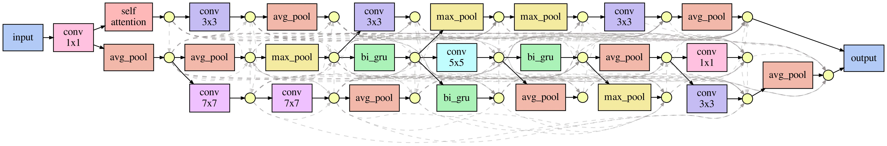

# NNI-ENAS-NLP-Example
This code is for running enas_nlp (Neural Architecture Search for Text Classification and Representation) on nni.

## Overview

This is an example of running ENAS_NLP on [NNI](https://github.com/microsoft/nni) using NNI's NAS interface. The documents about NNI's NAS interface can be found [here](https://github.com/microsoft/nni/blob/master/docs/en_US/GeneralNasInterfaces.md).

This project includes code for 10 text classification tasks task. We conduct neural architecture search experiments in TensorFlow which redevelop the open source code of ENAS for our experiments. 

## Step

> RUN NAS

- `pip install -r requirements.txt`
- `export CUDA_VISIBLE_DEVICES=0`
- `cd NAS && nnictl create --config config.yml`

## Datasets

These datasets include:

    SST
    AG’s News
    Sogou News
    DBPedia
    Yelp Review Polarity
    Yelp Review Full
    Yahoo! Answers
    Amazon Review Full
    Amazon Review Polarity

For text classification task, we have provided SST dataset, and the remain datasets can be downloaded from https://drive.google.com/drive/u/0/folders/0Bz8a_Dbh9Qhbfll6bVpmNUtUcFdjYmF2SEpmZUZUcVNiMUw1TWN6RDV3a0JHT3kxLVhVR2M

SST is short for Stanford Sentiment Treebank which is a commonly used dataset for sentiment classification. 
There are about 12 thousands reviews in it and each review is labeled to one of the five sentiment classes. 
There is another version of the dataset, SST-Binary, which has only two classes representing positive/negative while the neutral samples are discarded.

## Neural Architecture Search for Text Classification and Representation

We propose a novel search space consisting of convolutional, recurrent, pooling, and self-attention layers. 
The search space is based on a general DAG and supports ensembles of multiple paths. 
We adopt ENAS (Efficient Neural Architecture Search) as the automatic search algorithm, which offers a good trade-off between accuracy and efficiency. 

Given the search space and search algorithm, the whole pipeline consists of three steps. 
First, neural architecture search is performed on the training set by utilizing the validation data for evaluation. 
Second, we conduct grid search on the validation data with the result architecture to search for the best configuration of hyper-parameters. 
Finally, the derived architecture is trained from scratch with the best configuration on the combination of training and validation data. 

## Search Space

We notice that different construction orders sometimes lead to the same network architecture. 
We put a constraint on the search space to mitigate this kind of duplication and accelerate the search procedure. 
Concretely, layer _i_ must select its input from previous _k_ layers, where _k_ is set to be a small value. 
In this way, we favor the BFS-style construction manner in Figure a instead of Figure b. 
For example, if we set _k = 2_, the case in Figure b can be skipped because layer 4 cannot take layer 1 as input directly. 

In our experiments, we set _k=5_ as a trade-off between expressiveness and search efficiency. 

#### Figure a 


#### Figure b



The tensor shape of the input word sequence is _<batch_size, emb_dim, max_len>_, where _batch_size_ is the pre-defined size of mini-batch; 
_emb_dim_ is the embedding dimension of word vectors and _max\_len_ denotes the max length of the word sequence. 
In our implementation, we adopt a fixed-length representation, i.e., additional _pad_ symbols are added to the tail if the input length is smaller than _max_len_; 
and the remaining text is discarded if the input length is larger than _max\_len_. 
In all the layers, we keep the tensor shape as _<batch_size, dim, max_len>_, where _dim_ is the dimension of hidden units. 
Note that _dim_ may not equal to _emb_dim_, so an additional 1-D convolution layer is applied after the input layer. 

After the network structure is built, the next step is to determine the operators in each layer. 
In the search space, we incorporate four categories of candidate layers which are commonly used for text representation, namely _Convolutional Layers, Recurrent Layers, Pooling Layer, and Multi-Head Self-Attention Layers_. 
Each layer does not change the shape of input tensor, so one can freely stack more layers as long as the input shape is not modified.

## ENAS_NLP_NNI structure 

The structure of this project is illustrated as below<br>
```
.
└── general_controller
    └── controller
        ├── common_ops.py
        ├── general_controller.py
        ├── tf_flags.py
        └── utils.py
    └── RL_tuner.py
└── imgs
└── NAS
    └── data
        ├── sst
        ├── ...
        └── tokenizer.sed
    └── src
        └── enasnlp
            ├── data_utils.py
            ├── general_child.py
            ├── models.py
            ├── nni_child_nlp.py
            └── ptb.py
        ├── common_ops.py
        ├── nlp_flag.py
        └── utils.py
    ├── config.yml
    └── run_search_arc_multi_path.sh
```

**general_controller.py:** uses LSTM layer to generate the choice of each layer sequentially according to the topological order.
As can be seen in arcs.sh, the searched architectures are stored in the form of a pyramid. 
The first column represents the input of current layer (k<=5); The second column represents the selected operation;
The remaining columns represent the selected skip connections.

**general_child.py:** uses NNI annotation to express the candidate layers/sub-models. 
Since each layer has to choose a specific input, we divided each layer into two pieces, one is to choose operations and input, another one is to choose skip connections.

**RL_tuner.py:** selects the corresponding operation/input/skip in NNI annotation according to the generated architectures from general_controller.py.

## Results

In our experiments, we perform 24-layer neural architecture search on SST dataset and evaluate the derived architectures on both SST and SST-Binary datasets. 
We follow the pre-defined train/validation/test split of the datasets{https://nlp.stanford.edu/sentiment/code.html}. 
The word embedding vectors are initialized by pre-trained GloVe (glove.840B.300d{https://nlp.stanford.edu/projects/glove/}) and fine-tuned during training. 
We set batch size as 128, hidden unit dimension for each layer as 32.

During search process (in NNI environment), the test result of SST is about **0.44**.
The searched architectures are named as ARC-I, ARC-II and ARC-III respectively.
We evaluate ARC-I, ARC-II and ARC-III by training them from scratch and report the average accuracy of 5 runs on the datasets.
In addition,we evaluate the accuracy of assembling ARC-I, II and III together as a joint architecture with a linear combination layer on the top.

model | SST | SST-B | AG | SOGOU | DBP | YELP-B | YELP | YAHOO | AMZ | AMZ-B
:----: | :----: |:----: |:----: | :----: |:----: |:----: | :----: |:----: |:----: |:----: 
ARC-I | 51.77 | 89.94 | 93.14 | 96.76 | 99.01 | 96.41 | 66.56 | 73.97 | 63.14 | 95.94 
ARC-II | 52.51 | 88.92 | 92.80 | 97.17 | 98.96 | 96.22 | 66.02 | 74.09 | 62.95 | 95.90 
ARC-III | 52.79 | 89.27 | 91.71 | 96.60 | 98.96 | 96.13 | 66.26 | 73.79 | 63.17 | 95.93 
JOINT-ARC | 53.44 | 90.23 | 93.29 | 97.35 | 99.06 | 96.61 | 67.28 | 74.57 | 63.86 | 96.25

#### ARC I


#### ARC II


#### ARC I
